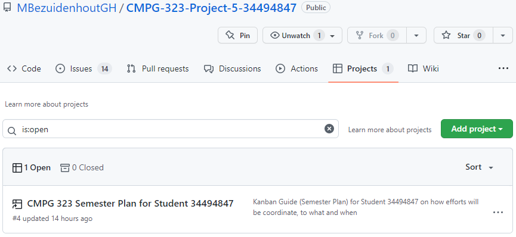
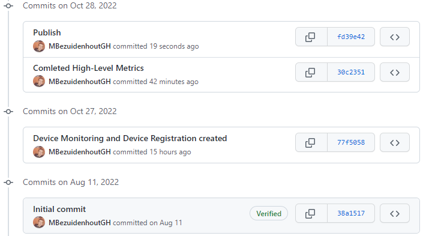

PS: I HAVE A **STRETCH TASK** FOR THIS PROJECT, please see Scrum Implementation section
<h2>How to use the automation</h2>

	Check out this video I made 😎 <a href="https://www.youtube.com/watch?v=iTHTtf828l8">CMPG-323-Project-4-34494847 | Testing & RPA | UiPath</a> <- (CLICK THE BLUE TEXT) 
	which demonstrates student 34494847's working project 4 on testing & RPA. The first part of the video is a very brief walkthrough of the project 
	to talk about my thoughts on developing the mechanisms. I run the project from the UI Path desktop application then lastly, I show that I also 
	hosted my project on orchestrator and run it from orchestrator as well. 
	 

<h2>Data Access</h2>

	The student has made use of the provided test data (Connected Office Test Data.xlsx) to test the solution which has been executed on a web app
	that has been hosted online (https://connectedoffice-devicemanagement.azurewebsites.net/).

<h2>Robotic Process Automation</h2>

	The student created a basic UiPath process that can be used to conduct user acceptance testing, the entry point for the automation is my MainFlow file
	which brings all my workflows together and execute them in order:  
	  
	  
	The student attached the UiPath processes to a browser (Chrome) to execute the testing tasks:  
	  
	  
	  
	  
	The student ensured that functionality exists within the UiPath processes to test CRUD for Zones, Devices and Categories, also
	accommodation has been made for the login process. No screenshots will be shared on this because the project can be accessed
	in the repository.

<h2>Testing</h2>

	The student created all required mechanisms that successfully tests the CRUD functionality for all zones, categories and devices test cases
	after which the test results tab on the excel sheet is updated which is demonstrated here: <a href="https://www.youtube.com/watch?v=iTHTtf828l8">CMPG-323-Project-4-34494847 | Testing & RPA | UiPath</a>.
	I completed a stretch task which was not specified as part of the brief, I designed a repository pattern to split up my workflows and 
	then added them to my main workflow known as MainFlow to indicate the sequence in which the workflows must be completed. I did this because if there 
	was to be a new data table then a new workflow can be simply be added in a seperate file which then can be added to my MainFlow, if
	there was to be only one workflow where all processes are implemented then adding a new data table would be a extreme hastle because
	everything will have to be modified.

<h2>Hosting</h2>

	The student has hosted the process on the UiPath Orchestrator:  
	  
	  
	  
	 

<h2>Scrum Implementation</h2>

	The student has successfully kept his GitHub board updated throughout Project 4 as the board was set up in Project 1. Also, the student's Project 4 repository is 
	linked to his GitHub board and a lot of effort was done to link the exact repositories of each Project that was done and what must be done to each task (Repository 
	and Linked Assessment fields). I completed a stretch task which was not specified as part of the brief, I designed a repository pattern to split up my workflows and 
	then added them to my main workflow known as MainFlow to indicate the sequence in which the workflows must be completed. I did this because if there 
	was to be a new data table then a new workflow can be simply be added in a seperate file which then can be added to my MainFlow, if
	there was to be only one workflow where all processes are implemented then adding a new data table would be a extreme hastle because
	everything will have to be modified.  
	 

<h2>Source Control</h2>

	The student added Project 4 to his GitHub profile on day 1 and every change that has been decided to commit was committed. The branching strategy that was set up in 
	Project 1 was followed to the T which demonstrated an iterative use of GitHub throughout Project 4 to successfully manage version control of the project. The student 
	also did a lot of effort in providing a very well laid out README.md file by explaining everything possible to make it easier for the person trying to figure everything out. 
	 The student started developing Project 4 on Oct 15, 2022:  
	  
	The student also ensured that no credentials are available or present in the repository, apart from the testing account in the automation.

<h2>Reference List</h2>

	The student provided a reference list with over 25 references on the Project 4 repository and the submission form. Only websites that were relevant and actually useful to 
	produce this successful project were referenced.

